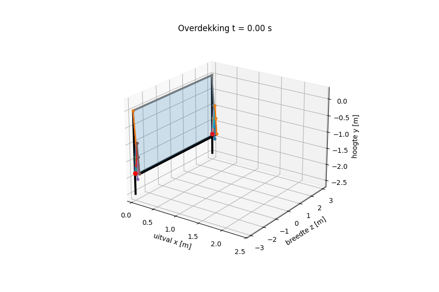
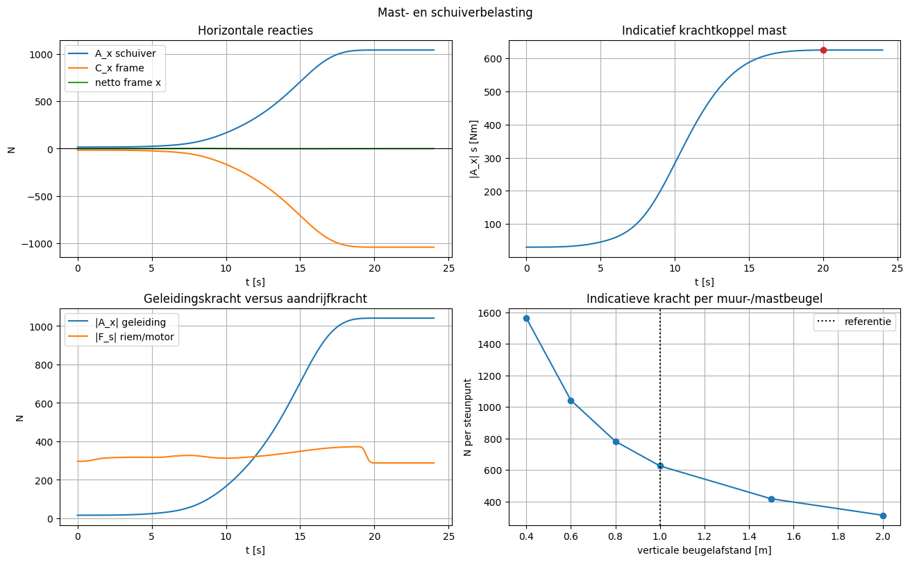
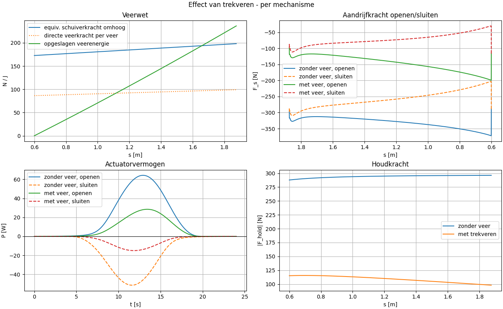
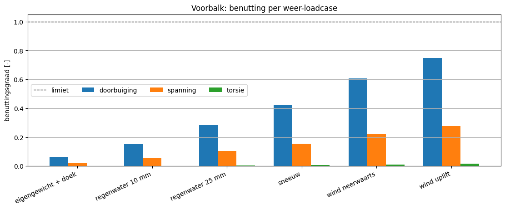
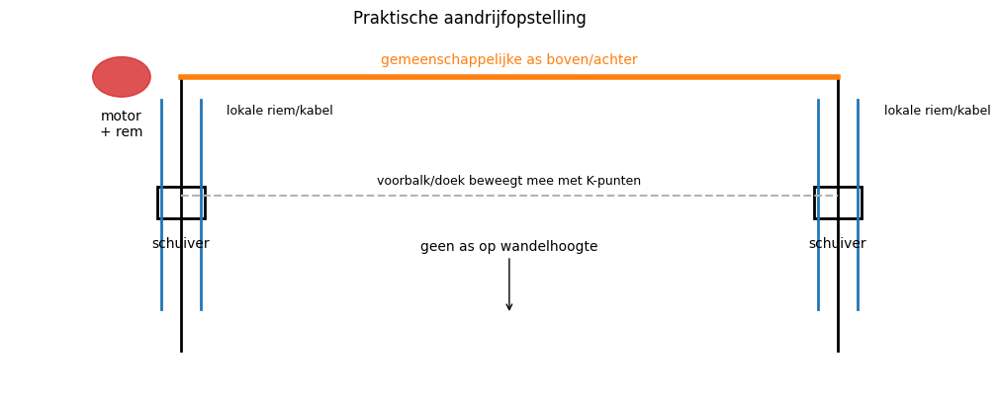
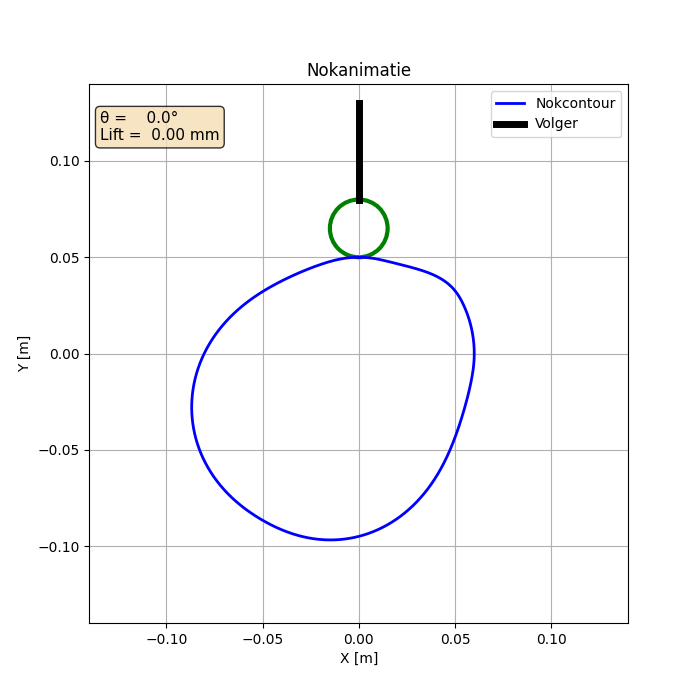
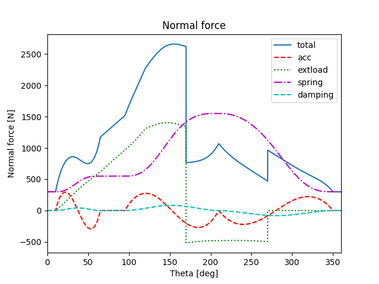
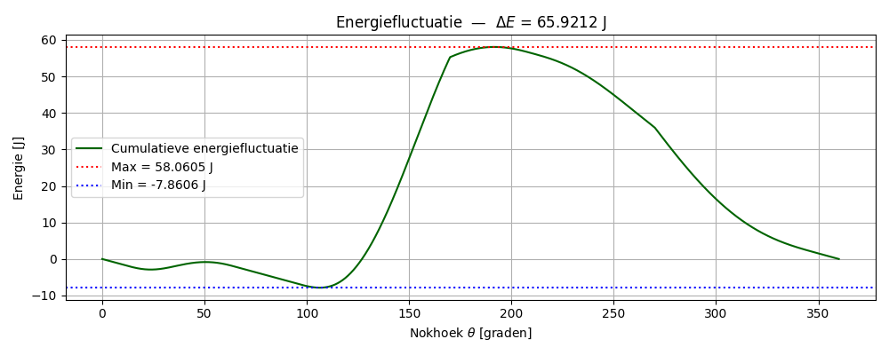

# Bewegingen-trillingen-project

**English** · [Nederlands](README.nl.md)

This project for the **Beweging en Trillingen** course works from prescribed motion towards the mechanical design of two systems: a folding linkage developed into a motorised canopy and a rotating cam with a translating roller follower. Python notebooks connect geometry and motion to joint forces, spring assistance, structural loads and drive sizing.

The canopy is the main design study. Two folding mechanisms support a 6 m wide fabric cover and must open together from one motor. The separate cam study examines how the lift law, contact geometry and follower spring affect the torque and energy demanded from a continuously rotating drive. Both are calculated designs; the repository contains no prototype measurements.



*The saved canopy animation shows the complete arrangement. Playback is accelerated: the modelled opening takes 20 s, followed by a 4 s hold.*

## A canopy that can open without overloading its guides

Each canopy support is a planar linkage with eight links including the fixed mast and one degree of freedom. A slider drives the connected ribs; the outer tip K carries the front beam. The slider coordinate $s$ is measured downwards from the fixed pivot C, so the mechanism opens as $s$ decreases. In the selected case it moves from 1.875 m to 0.600 m, giving a 1.275 m stroke and about 2.22 m of horizontal canopy projection.

The open position is a deliberate compromise. Extending the mechanism towards a nearly horizontal roof strongly increases the transverse reactions at the slider and mast. The final case stops with the outer rib sloping down by about **15.3°**. It gives up some reach to keep the guide loading manageable. This geometric choice matters before selecting a motor: a smaller actuator does not solve an excessive side load.

[Notebook 1](project/Stangen/Notebook%201.ipynb) solves six closure equations from three vector loops using SciPy's `fsolve`. Each converged configuration seeds the next step to stay on the same assembly branch. Differentiating those equations gives linear systems for the link velocities and accelerations. The `condition_scurve` input uses a seventh-degree motion law and slows near the more sensitive closed configuration. Slowing reduces the motion demands there; it does not change the geometric conditioning.

[Notebook 3 - Overdekking](project/Stangen/Notebook%203%20-%20Overdekking.ipynb) then assembles 21 Newton–Euler equations for the seven moving bodies. The known motion determines the actuator and joint forces, including gravity, slider friction and pin friction. Reaction-dependent friction is resolved iteratively. The front beam, fabric and fittings contribute an equivalent tip mass of about 27.32 kg per mechanism. At the selected slow opening speed, gravity and friction dominate the drive load.

The plot below separates the local support reactions from the actuator force. Its force curves are plotted against time; the lower-left panel compares the horizontal slider reaction with the vertical drive force. In the baseline without springs, the guide must carry about **1.04 kN** while the peak opening drive force is about **372 N**. Opposing reactions can cancel in the total frame balance while still imposing substantial local loads. The mast, guide and their brackets therefore need their own sizing.



## Springs reduce the drive load

Two preloaded tension springs per mechanism assist the slider directly. Each has a modelled stiffness of 10 N/m; together they exert about 172.7 N when open and 198.2 N when closed. The springs store energy during closing and return it during opening. They reduce the motor's load but leave the horizontal guide load to the structure.

The comparison uses the saved canopy results with and without springs. Force against slider position shows the reduced opening demand, while the power and holding-force panels show how the benefit changes through the stroke. Force signs follow the downward-positive slider coordinate; positive power means the actuator supplies work.



| Calculated quantity | Without springs | With springs |
| --- | ---: | ---: |
| Peak opening drive force per mechanism, magnitude | 372.2 N | 199.5 N |
| Work-surplus energy fluctuation per mechanism | 241.0 J | 105.9 J |
| Suitable motor class in the notebook comparison | 750 W servo with brake | 500 W BLDC with brake |

For this intermittent opening and holding motion, gravity compensation addresses the main load directly. A flywheel is better suited to the repeating energy exchange of the cam study below. The canopy still needs a brake or lock to hold intermediate positions.

## Supporting the cover and driving both sides together

The front beam must be stiff enough across a 6 m span, but its mass also increases the linkage load. The canopy notebook checks a simply supported aluminium **200 × 100 × 5 mm** rectangular tube under self-weight, retained rainwater, snow, downward wind and wind uplift. Fabric loading is assigned through half the canopy depth. The figure compares deflection, combined stress and torsion with the chosen limits; a utilisation of 1 reaches a limit.



Wind uplift governs with a maximum utilisation of **0.749**. Its calculated deflection magnitude is **15.0 mm** against a 20 mm limit and its von Mises stress is about **27.7 MPa** against 100 MPa. These weather checks concern the structure. The drive calculation uses the ordinary motion case with gravity and friction; its motor selection does not establish the ability to move the canopy under those weather loads.

[Notebook 4](project/Stangen/Notebook%204.ipynb) translates the spring-assisted loads into one motor, a common shaft and two local belt/cable drives. The shaft synchronises the mechanisms; the shared front beam is not the synchronising device. Both sides must remain in phase to avoid skewing the fabric and beam. The proposed shaft runs above or behind the canopy, clear of the walking area.



With a 25 mm pulley radius and 25:1 reduction, the saved sizing gives a combined design line force of about **798 N**, an output drive torque of **21.7 N·m** and a required output brake torque of **11.6 N·m**. Peak calculated motor-input power is 146.3 W. Torque and brake capacity also govern the choice: the notebook selects an assumed **500 W, 48 V BLDC class** with gearbox, encoder and brake. This is a comparison of modelled component classes, not a specified commercial assembly.

The selected Ø40/30 mm tubular shaft twists about **0.55°** over 6 m against a 2° limit. Positioning accuracy consequently depends on shaft, belt and guide stiffness as well as the encoder. The design also compares the opening-force spectrum with an estimated beam frequency, but this remains a preliminary check rather than a modal analysis of the complete assembly.

At the assumed one opening–closing cycle per day over 220 days, the spring-assisted motion consumes about **0.029 kWh per year**, excluding controller standby consumption. The notebook's estimated hardware cost of roughly **€6,600–€11,900**, excluding professional installation and engineering, highlights the larger concern: mechanical complexity and component cost dominate the energy needed for such infrequent motion. These are notebook assumptions, not current quotations.

The linkage model uses rigid bodies, followed by separate beam, mast and shaft checks. Connections, anchors, fatigue, flexible-body dynamics and uneven weather loading would need further work before building the system. Numerical closure and power-balance checks test the calculation's consistency; experimental validation is not included.

## A cam that maintains contact and buffers changing torque

The independent [cam study](project/Nokken/) uses a vertical roller follower with zero offset. In a **0.500 s cycle at 120 rpm**, it rises to 10 mm, dwells, rises to 50 mm, returns and dwells again. The chosen fifth-degree motion law is

$$
y(\tau)=10\tau^3-15\tau^4+6\tau^5,
\qquad s=s_0+h\,y(\tau).
$$

Here $\tau$ runs from 0 to 1 over each motion segment and $h$ is its signed lift change. Displacement, velocity and acceleration join continuously at the dwells, although jerk has finite jumps. Motion-law choice therefore affects both the inertial force and its frequency content. For unchanged geometry, increasing rotational speed makes acceleration grow with the square of speed.



*The saved animation shows two revolutions of the calculated profile. Its playback timing differs from the physical operating speed.*

[Nok_1](project/Nokken/Nok_1_Kinematica_en_Geometrie.ipynb) compares motion laws and uses pressure-angle and curvature constraints to select the geometry. The stored case uses `R_0 = 50 mm` and a 15 mm roller radius. Pressure angles range from about −23.8° to +21.9°, within the chosen ±30° criterion. The geometry check reports no undercutting.

[Nok_2](project/Nokken/Nok_2_Dynamica_Veer_Vliegwiel.ipynb) adds a 29 kg equivalent follower mass, the prescribed external load, a 25 kN/m spring, damping and guide friction. The computed minimum spring preload is **284.5 N**; the chosen **300 N** keeps the calculated normal force positive throughout the cycle. The graph separates the force contributions against cam angle. Contact must be maintained, but extra preload also increases loading and friction.



The drive must handle a changing torque despite constant prescribed speed. The saved calculation gives mean mechanical power of **110 W** and mean torque of **8.78 N·m**. The cumulative work-surplus curve below shows where energy must be supplied or buffered relative to the mean torque. Its peak-to-trough difference is **65.9 J**; this is the energy fluctuation, not the total energy consumed per cycle.



For a speed-fluctuation coefficient $K=0.05$, the flywheel estimate is

$$
I=\frac{\Delta E}{K\omega^2}=8.35\ \mathrm{kg\,m^2}.
$$

That substantial inertia motivates considering a servo drive as an alternative. Neither solution was built or experimentally tested here. Follower motion is prescribed in this analysis, so the positive-force result checks contact feasibility within the model; it does not simulate contact loss and impact.

## Following the calculations

The main canopy route is **Notebook 1 → Notebook 3 - Overdekking → Notebook 4**. The canopy notebook reads the kinematics directly from Notebook 1. The cam notebooks each contain their own setup; read them in numbered order to follow geometry, forces and animation.

| Notebook | Role in the design |
| --- | --- |
| [Stangen / Notebook 1](project/Stangen/Notebook%201.ipynb) | Linkage geometry, motion law, kinematics and conditioning |
| [Stangen / Notebook 3 - Overdekking](project/Stangen/Notebook%203%20-%20Overdekking.ipynb) | Canopy loads, spring assistance, structural checks and 3D motion |
| [Stangen / Notebook 4](project/Stangen/Notebook%204.ipynb) | Drive, motor class, brake, shaft and positioning |
| [Nokken / Nok_1](project/Nokken/Nok_1_Kinematica_en_Geometrie.ipynb) | Motion law, cam profile, pressure angle and curvature |
| [Nokken / Nok_2](project/Nokken/Nok_2_Dynamica_Veer_Vliegwiel.ipynb) | Contact force, spring preload, torque and flywheel |
| [Nokken / Nok_3](project/Nokken/Nok_3_Animatie.ipynb) | Cam and follower animation |

The earlier single-mechanism study runs through [Notebook 2](project/Stangen/Notebook%202.ipynb), [Notebook 3](project/Stangen/Notebook%203.ipynb) and [Notebook 3 - Trekveren](project/Stangen/Notebook%203%20-%20Trekveren.ipynb) after Notebook 1. The [parameter optimisation notebook](project/Stangen/Notebook%201%20parameter%20optimalisatie.ipynb) is a separate exploratory geometry study.

```text
project/
  Stangen/                  Linkage and canopy notebooks
    resultaten/             Saved NPZ calculations passed between notebooks
    figuren/                Exported plots and animations
    afbeeldingen/           Original mechanism and drive illustrations
  Nokken/                   Cam notebooks
    figuren/                Exported plots and animation
    afbeeldingen/           Original cam illustration
```

The notebooks contain the detailed derivations, model parameters and saved outputs. The figures and values here follow their stored design cases.

## Exploring and reproducing the work

Start by opening the notebooks and inspecting their saved outputs. To execute them, use a local Python 3 environment with NumPy, SciPy, Matplotlib, pandas and IPython. The widget plots also require `ipympl`. Exact package versions and a minimum Python version are not declared; NumPy must provide `np.trapezoid`.

For a fresh environment on Windows:

```powershell
python -m venv .venv
.\.venv\Scripts\python.exe -m pip install numpy scipy matplotlib pandas ipympl jupyterlab ipykernel
.\.venv\Scripts\python.exe -m jupyter lab
```

Select this environment as the notebook kernel in JupyterLab or VS Code. Its working directory must be the notebook's folder: `project/Stangen` or `project/Nokken`. Parameters live in notebook setup cells; the NPZ files under `resultaten/` are calculated outputs, not experimental inputs.

For the canopy, run Notebook 1 from top to bottom, then Notebook 3 - Overdekking with `compute_spring_assist_case = True`, then Notebook 4 with `load_case = "overdekking_trekveren"`. Use `load_case = "overdekking"` in Notebook 4 for the canopy baseline without springs. Changing geometry or motion requires rerunning downstream notebooks to refresh their input archives.

For the earlier single mechanism, run Notebooks 1, 2 and 3, then Notebook 3 - Trekveren if required. Notebook 4 selects those cases with `load_case = "baseline"` or `load_case = "trekveren"`. Keep their results separate from the full canopy case. The cam notebooks run independently; changed parameters must be carried into each notebook manually.

Execution updates notebook outputs and, for the linkage study, the saved NPZ results. The README figures are static exports and do not update automatically. Its six plots come from the existing calculations and both GIFs reuse saved animation frames. No mechanical analysis was rerun to prepare these documents.
